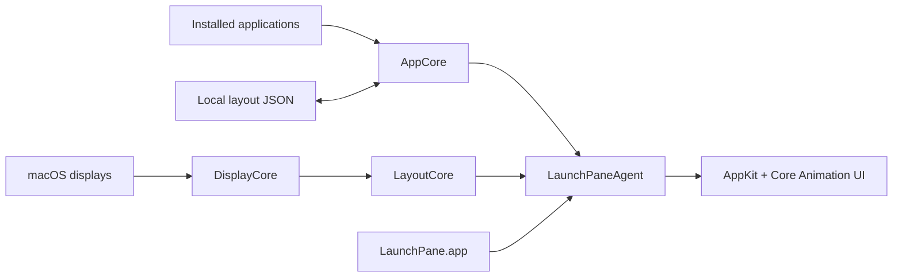

# LaunchPane

**Bring back the classic full-screen app launcher on macOS.**

LaunchPane is a fast, native, open-source Launchpad replacement built with **Swift 6**, **AppKit**, and **Core Animation**. It gives you a full-screen app grid, instant local search, folders, persistent drag-and-drop organization, and smooth paging without accounts, telemetry, or mandatory network access.

<p align="center">
  <a href="https://github.com/LuckyFishOno/launchpane/releases/latest"></a>
  
  
  
  <a href="LICENSE"></a>
</p>

<p align="center">
  
</p>

<p align="center">
  <a href="https://github.com/LuckyFishOno/launchpane/releases/latest/download/LaunchPane.dmg"><strong>Download LaunchPane</strong></a>
  ·
  <a href="https://github.com/LuckyFishOno/launchpane/releases/latest">Release notes</a>
  ·
  <a href="#build-from-source">Build from source</a>
  ·
  <a href="https://github.com/LuckyFishOno/launchpane/issues">Report an issue</a>
</p>

<p align="center">
  macOS 15+ · Apple silicon · MIT licensed · Local-first
</p>

## Why LaunchPane?

LaunchPane is designed for people who want the familiar full-screen macOS app-grid experience with predictable organization and native interactions.

| | |
| --- | --- |
| **Native macOS UI** | Built with AppKit and Core Animation using documented system APIs. |
| **Persistent organization** | Reorder apps, create folders, move items across pages, and keep the layout between launches. |
| **Fast navigation** | Search locally, page with a trackpad or mouse, and navigate from the keyboard. |
| **Adaptive layout** | Handles Retina and non-Retina displays, mixed-scale multi-display setups, and different scaling modes. |
| **Private by default** | No account, activation, analytics, telemetry, or mandatory network connection. |
| **Accessible** | Keyboard navigation, accessibility semantics, right-to-left layout support, and Reduce Motion behavior. |

## Features

- Full-screen adaptive app grid
- Installed application discovery
- Instant local search with IME-aware input
- Folder creation and management
- Persistent drag-and-drop reordering
- Cross-page dragging with edge paging
- Folder-item reordering and multi-page folders
- Folder-to-root extraction
- Trackpad, mouse, and keyboard paging
- Page-local placement with forward overflow
- Multi-display and mixed-scale support
- Keyboard navigation, RTL layout, and Reduce Motion support
- Reset Launchpad action

## Requirements

- **macOS 15 or later**
- **Apple silicon Mac** (M1 or newer)

Intel Macs are not currently supported.

## Install

1. [Download the latest `LaunchPane.dmg`](https://github.com/LuckyFishOno/launchpane/releases/latest/download/LaunchPane.dmg).
2. Open the disk image.
3. Drag **LaunchPane.app** into **Applications**.
4. Open LaunchPane from **Applications**.
5. Optionally, right-click **LaunchPane** in the Dock → **Options** → **Keep in Dock** for one-click access.

### First launch on macOS

> [!NOTE]
> The current downloadable build is not notarized with an Apple Developer ID. macOS may therefore block the first launch until you explicitly approve it. This is a one-time step for the downloaded build.

If macOS shows an **“LaunchPane” Not Opened** warning:

1. Click **Done**.
2. Open **System Settings → Privacy & Security**.
3. Scroll to **Security**.
4. Click **Open Anyway** for LaunchPane.
5. Authenticate if requested.
6. Click **Open**.


If you prefer not to use the downloadable build, you can [build LaunchPane from source](#build-from-source).

## Build from source

### Prerequisites

- Apple silicon Mac running macOS 15 or later
- Xcode 26 or later
- Swift 6
- [XcodeGen](https://github.com/yonaskolb/XcodeGen) 2.42 or later only if you want to regenerate the Xcode project

### Build

```bash
git clone https://github.com/LuckyFishOno/launchpane.git
cd launchpane

xcodebuild \
  -project LaunchPane.xcodeproj \
  -scheme LaunchPane \
  -configuration Release \
  CONFIGURATION_BUILD_DIR="$PWD/Builds" \
  clean build

open Builds/LaunchPane.app
```

### Run the test suite

```bash
swift test
```

## Local data and privacy

LaunchPane stores its layout locally at:

```text
~/Library/Application Support/LaunchPane/LauncherLayout.json
```

The layout uses explicit pages. Removing an app from one page does not pull apps backward from later pages, while dropping onto a full page pushes overflow forward and creates another page when needed.

LaunchPane does not require an account and does not send analytics or telemetry.

## Architecture

LaunchPane separates application discovery, display geometry, layout behavior, and presentation so each part can be tested independently.



The launcher process stays intentionally small, while the persistent UI lives in `LaunchPaneAgent`. Display geometry flows through `DisplayContext` and `LayoutConstraintSolver`, and drag-and-reorder behavior is modeled as an explicit state machine with transaction and rollback semantics.

For implementation details, see [Architecture](docs/ARCHITECTURE.md) and [Paging performance](docs/PAGING_PERFORMANCE.md).

## Contributing

Bug reports and focused pull requests are welcome. See [CONTRIBUTING.md](CONTRIBUTING.md) before opening a pull request.

Useful feedback includes:

- interaction or animation issues
- unusual display or scaling configurations
- keyboard or accessibility behavior
- app-discovery edge cases
- reproducible drag-and-drop problems

If LaunchPane is useful to you, **star the repository** — it helps more Mac users discover the project.

## License

LaunchPane is available under the [MIT License](LICENSE).

LaunchPane is an independent open-source project and is not affiliated with or endorsed by Apple Inc. macOS, Launchpad, and Apple are trademarks of Apple Inc.
