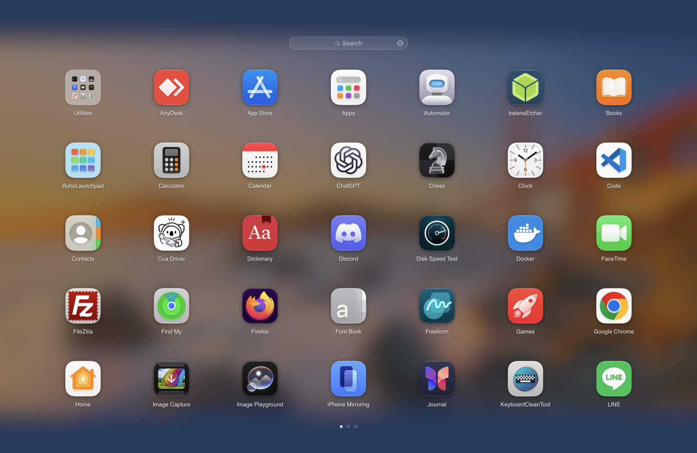
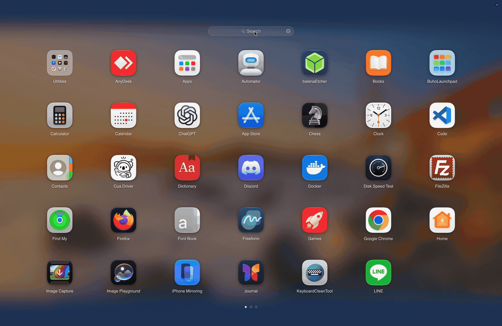
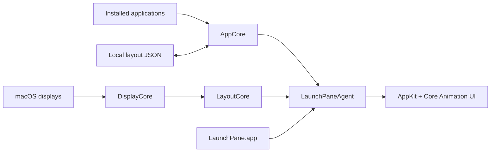

# LaunchPane

**A fast, native Launchpad-style app launcher for modern macOS.**

LaunchPane gives Apple silicon Macs a familiar full-screen app grid with instant search, folders, drag-and-drop organization, and smooth paging. It is open source, local-first, and built with Swift, AppKit, and Core Animation.

<p align="center">
  <a href="https://github.com/LuckyFishOno/launchpane/releases/latest"></a>
  
  
  
  <a href="LICENSE"></a>
</p>

<p align="center">
  
</p>

<p align="center">
  <a href="https://github.com/LuckyFishOno/launchpane/releases/latest/download/LaunchPane.dmg"><strong>Download LaunchPane</strong></a>
  ·
  <a href="#install">Install</a>
  ·
  <a href="#first-launch">First launch</a>
  ·
  <a href="#build-from-source">Build from source</a>
  ·
  <a href="https://github.com/LuckyFishOno/launchpane/issues">Report an issue</a>
</p>

## See LaunchPane in action

<p align="center">
  
</p>

## Why use it?

LaunchPane is for Mac users who miss a simple, visual way to open and organize apps. It keeps the classic full-screen launcher feeling, while making the behavior predictable: folders stay put, pages do not unexpectedly collapse, and your layout is saved locally.

| What you get | Why it matters |
| --- | --- |
| **Full-screen app grid** | Browse installed apps visually, with a layout that adapts to your display. |
| **Instant local search** | Find apps quickly without accounts, indexing services, or network calls. |
| **Folders and drag-and-drop** | Group apps, reorder pages, move items across pages, and keep the layout. |
| **Native macOS feel** | AppKit and Core Animation, with trackpad, mouse, and keyboard navigation. |
| **Private by default** | No telemetry, no login, no activation, and no mandatory internet connection. |

## Features

- Adaptive full-screen app grid
- Installed app discovery with automatic refresh when new apps are added
- Instant local search with IME-aware input
- Folder creation and management
- Persistent drag-and-drop organization across pages
- Cross-page dragging with edge paging
- Trackpad, mouse, and keyboard paging
- Multi-display and mixed-scale display support
- Accessibility semantics, keyboard navigation, RTL layout, and Reduce Motion support
- Reset action for restoring the default launcher layout

## Requirements

- macOS 15 or later
- Apple silicon Mac, M1 or newer

Intel Macs are not currently supported.

## Install

1. Download the latest [`LaunchPane.dmg`](https://github.com/LuckyFishOno/launchpane/releases/latest/download/LaunchPane.dmg).
2. Open the disk image.
3. Drag **LaunchPane.app** into **Applications**.
4. Open **LaunchPane** from Applications.
5. Keep it in the Dock if you want one-click access.

## First launch

The downloadable build is not notarized yet, so macOS will ask you to approve it the first time. This is expected for an unsigned open-source build downloaded outside the Mac App Store.

If macOS shows **“LaunchPane” Not Opened**:

1. Click **Done**.
2. Open **System Settings**.
3. Go to **Privacy & Security**.
4. Scroll to **Security**.
5. Click **Open Anyway** for LaunchPane.
6. Authenticate if macOS asks.
7. Click **Open**.


After this one-time approval, LaunchPane opens normally. If you would rather avoid this Gatekeeper step, build the app from source with Xcode.

## First use

LaunchPane opens as a full-screen app grid. New apps installed into `/Applications`, `/System/Applications`, or `~/Applications` are detected and added to the pane automatically.

Useful interactions:

- Type to search.
- Drag apps to reorder them.
- Drag one app onto another app to create a folder.
- Drag near the left or right edge to move across pages.
- Click outside a folder to close it.
- Use the reset action if you want to rebuild the default layout.

## Build from source

### Prerequisites

- Apple silicon Mac running macOS 15 or later
- Xcode 26 or later
- Swift 6
- [XcodeGen](https://github.com/yonaskolb/XcodeGen) 2.42 or later, only if you regenerate the Xcode project

### Build

```bash
git clone https://github.com/LuckyFishOno/launchpane.git
cd launchpane

xcodebuild \
  -project LaunchPane.xcodeproj \
  -scheme LaunchPane \
  -configuration Release \
  CONFIGURATION_BUILD_DIR="$PWD/Builds" \
  clean build

open Builds/LaunchPane.app
```

### Run focused tests

```bash
swift test --filter FolderMergeGeometryTests
swift test --filter LauncherLayoutStoreTests/testReconcileAndCommitAppendsNewApplicationsToExistingLayout
```

## Local data and privacy

LaunchPane stores its layout locally at:

```text
~/Library/Application Support/LaunchPane/LauncherLayout.json
```

LaunchPane does not require an account and does not send analytics or telemetry. Layout data stays on your Mac.

## Architecture

LaunchPane separates app discovery, display geometry, layout behavior, and presentation so each part can be tested independently.



The visible app is a small launcher. The persistent UI lives in `LaunchPaneAgent`, which owns the full-screen window, icon rendering, search, paging, drag-and-drop, and accessibility behavior.

For more detail, see [Architecture](docs/ARCHITECTURE.md), [Memory](docs/MEMORY.md), and [Paging performance](docs/PAGING_PERFORMANCE.md).

## Contributing

Bug reports and focused pull requests are welcome. Useful reports include your macOS version, Mac model, display arrangement, and a short screen recording for interaction issues.

Areas where feedback helps most:

- drag-and-drop feel
- folder creation and reordering
- unusual display scaling or multi-display setups
- app discovery edge cases
- keyboard and accessibility behavior

If LaunchPane is useful to you, starring the repository helps more Mac users find it.

## License

LaunchPane is available under the [MIT License](LICENSE).

LaunchPane is an independent open-source project and is not affiliated with or endorsed by Apple Inc. macOS, Launchpad, and Apple are trademarks of Apple Inc.
